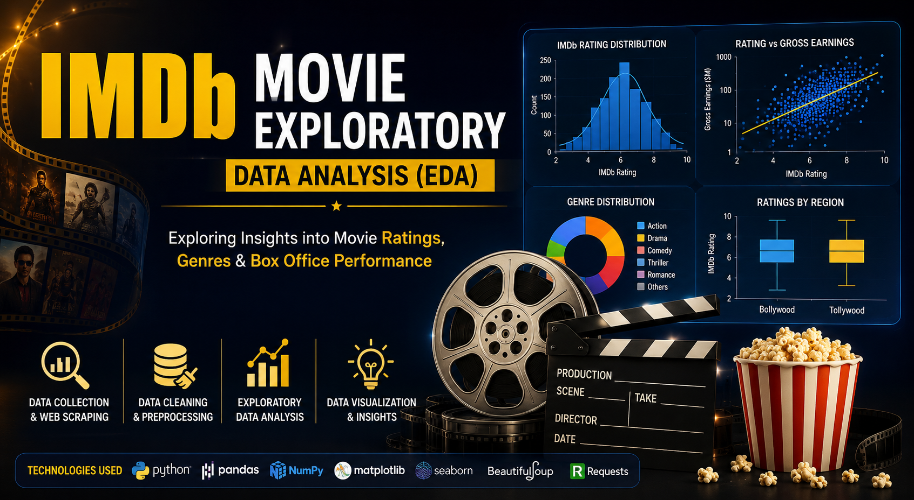
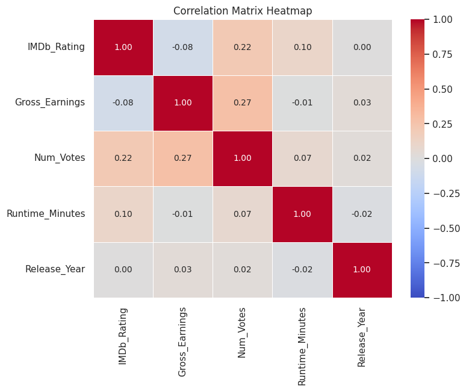
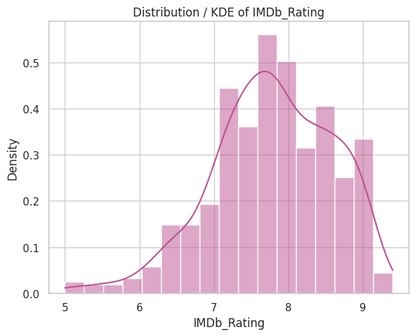
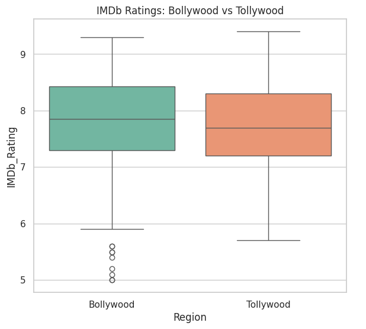
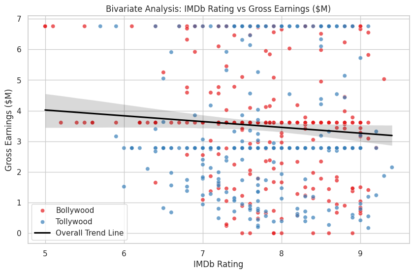
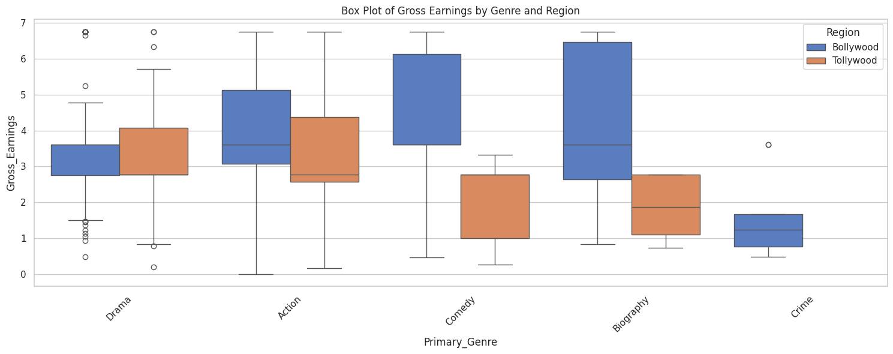
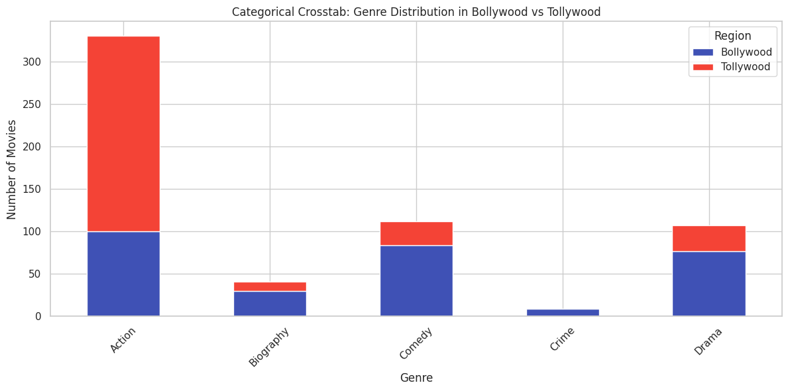

# 🎬 IMDb Movie Exploratory Data Analysis (EDA)




---

# 📑 Table of Contents

- 📌 Project Overview
- 🎯 Project Objectives
- 💼 Business Problem
- 🛠️ Technologies Used
- 📂 Project Structure
- 📊 Dataset
- ✨ Project Highlights
- 📈 Key Insights
- ▶️ How to Run the Project
- 📊 Sample Visualizations
- 📌 Conclusion
- 🚀 Future Improvements
- 👨‍💻 Author

---

# 📌 Project Overview

This project presents an end-to-end **Exploratory Data Analysis (EDA)** of IMDb movie data using Python.

The objective is to collect, clean, preprocess, analyze, and visualize IMDb movie data to discover meaningful insights into movie ratings, genres, audience preferences, and commercial performance.

The project also compares **Bollywood (Hindi)** and **Tollywood (Telugu)** movies to understand how different factors influence IMDb ratings and gross earnings.

---

# 🎯 Project Objectives

- Collect movie data using Web Scraping
- Clean and preprocess raw data
- Handle missing values
- Detect and treat outliers
- Perform Exploratory Data Analysis (EDA)
- Compare Bollywood and Tollywood movies
- Generate business insights using data visualization

---

# 💼 Business Problem

Movie producers, analysts, and entertainment companies need data-driven insights to understand the factors that influence movie success.

This project analyzes IMDb movie data to identify trends in ratings, genres, audience engagement, and gross earnings while comparing Bollywood and Tollywood movies using Exploratory Data Analysis techniques.

---

# 🛠️ Technologies Used

- Python
- Google Colab
- Pandas
- NumPy
- Matplotlib
- Seaborn
- BeautifulSoup
- Requests

---

# 📂 Project Structure

```text
IMDb-Movie-EDA/
│
├── notebook/
│   └── IMDb_Movie_Exploratory_Data_Analysis.ipynb
│
├── data/
│   ├── movies_raw.csv
│   └── movies_cleaned.csv
│
├── images/
│   ├── 01_correlation_heatmap.png
│   ├── 02_imdb_rating_distribution.png
│   ├── 03_imdb_rating_by_region_boxplot.png
│   ├── 04_rating_vs_gross_scatter.png
│   ├── 05_gross_by_genre_region_boxplot.png
│   ├── 06_genre_distribution_region.png
│   └── imdb_project_banner.png
│
├── README.md
├── requirements.txt
├── LICENSE
└── .gitignore
```

---

# 📊 Dataset

The dataset contains information about IMDb movies including:

- Movie Title
- Release Year
- Genre
- IMDb Rating
- Number of Votes
- Gross Earnings
- Runtime
- Director
- Certificate
- Region (Bollywood / Tollywood)

---

# ✨ Project Highlights

- Web Scraping of IMDb movie data
- Data Cleaning and Preprocessing
- Missing Value Treatment
- Outlier Detection
- Statistical Analysis
- Univariate Analysis
- Bivariate Analysis
- Multivariate Analysis
- Correlation Analysis
- Business Insights
- Data Visualization using Matplotlib & Seaborn

---

# 📈 Key Insights

- Compared Bollywood and Tollywood movies using IMDb ratings and gross earnings.
- Identified the distribution of movie genres across regions.
- Analyzed relationships among ratings, votes, runtime, and gross earnings.
- Detected missing values and outliers to improve data quality.
- Generated business-oriented insights using statistical analysis and visualizations.

---

# ▶️ How to Run the Project

### 1️⃣ Clone the repository

```bash
git clone https://github.com/your-username/IMDb-Movie-EDA.git
```

### 2️⃣ Install the required libraries

```bash
pip install -r requirements.txt
```

### 3️⃣ Open the notebook

Open the notebook using:

- Google Colab
- Jupyter Notebook

### 4️⃣ Run the notebook

Execute all notebook cells sequentially.

---

# 📊 Sample Visualizations

## 1. Correlation Matrix Heatmap



---

## 2. IMDb Rating Distribution



---

## 3. IMDb Rating by Region



---

## 4. IMDb Rating vs Gross Earnings



---

## 5. Gross Earnings by Genre and Region



---

## 6. Genre Distribution by Region



---

# 📌 Conclusion

This project demonstrates a complete Exploratory Data Analysis workflow, from data collection through web scraping to data preprocessing, visualization, statistical analysis, and business insight generation.

It highlights practical Data Science skills using Python and serves as a strong beginner portfolio project showcasing real-world EDA techniques.

---

# 🚀 Future Improvements

- Build an interactive dashboard using Streamlit
- Apply Machine Learning models for movie rating prediction
- Automate data collection using IMDb APIs
- Perform Sentiment Analysis using movie reviews
- Deploy the project as a web application

---

# 👨‍💻 Author

## Rohit Rajaram Yadav

**Aspiring Data Scientist | Python | SQL | Machine Learning | Generative AI**

⭐ If you found this project helpful, consider giving this repository a Star.
